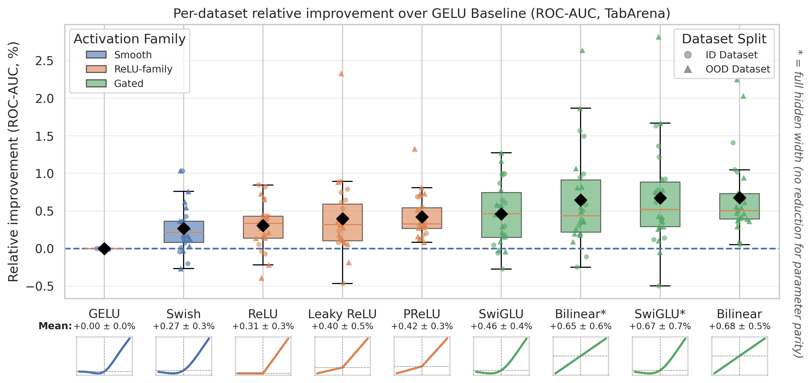
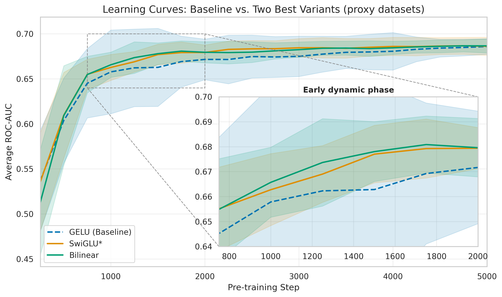

# NanoTabPFN Activation Function Ablation Study

This project investigates whether modern activation functions (SwiGLU, Mish, etc.) improve the performance of tabular foundation models compared to the standard GELU baseline. The codebase is a specialized, distributed fork built on top of [nanoTabPFN](https://github.com/automl/nanoTabPFN).

## Results

All activations were evaluated on the [TabArena](https://github.com/autogluon/tabarena) benchmark (26 classification datasets) using 20 seeds each. P-values are from a two-sided T-Test against the GELU baseline.

### Per-Dataset Relative Improvement over GELU



### TabArena ROC-AUC Summary

| Activation | Variant | ROC-AUC | p-value |
|---|---|---|---|
| Bilinear | Parameter-matched | **0.837** | 1.95e-07 |
| Bilinear | Full width | **0.837** | 1.50e-05 |
| SwiGLU | Parameter-matched | 0.836 | 5.07e-06 |
| SwiGLU | Full width | **0.837** | 7.33e-06 |
| PReLU | | 0.835 | 1.15e-08 |
| Leaky ReLU | | 0.835 | 1.49e-04 |
| ReLU | | 0.834 | 1.60e-05 |
| Swish | | 0.834 | 2.40e-04 |
| GELU (baseline) | | 0.832 | — |

All tested activations significantly outperform the GELU baseline (p < 0.001).

### Learning Curves: Baseline vs. Two Best Variants



---

## Local Setup & Development

This project uses [mise](https://mise.jdx.dev/) for Python version management and `uv` for dependency resolution.

```bash
mise install                # Installs Python 3.11 + uv
uv sync --extra dev         # Installs all dependencies including torch/rocm
```

**Testing & Formatting:**

```bash
bash scripts/verify.sh      # Runs ruff, pyright, and pytest
```

---

## Cluster Workflow (bwUniCluster 3.0)

Due to the scale of the ablation study, experiments are designed to run on the cluster utilizing **Slurm Job Arrays** and **Fair-Share Orchestration** across multiple cluster accounts.

The pipeline is fully automated and idempotent.

### 1. Initial Setup

Copy `.env.example` to `.env` and fill in your cluster connection details. Ensure your `WORKSPACE_DIR` points to a shared scratch workspace.

Sync your local code to the cluster (this excludes heavy data/checkpoints automatically):

```bash
bash scripts/cluster/sync.sh
```

### 2. Generate Pretraining Data (Run Once)

The model requires a massive prior dataset to pretrain. Log into the cluster and run the data generation script. It will generate a dataset tailored to our ablation bounds (200,000 datasets, up to 3000 rows, 45 features, 10 classes).

```bash
sbatch slurm/generate_data.sbatch
```

*Note: This is idempotent. If the `.h5` file already exists, it exits safely.*

### 3. Fair-Share Orchestration (Submitting Experiments)

We have split the 15 target activation functions into 3 "chunks". To maximize cluster priority (fair-share), you should run each chunk from a different collaborator's account.

Once the 15 target functions are decided, edit the arrays in `slurm/submit_chunk.sh`. Then distribute the execution:

```bash
# Collaborator 1 logs in and runs:
bash slurm/submit_chunk.sh 1

# Collaborator 2 logs in and runs:
bash slurm/submit_chunk.sh 2

# Collaborator 3 logs in and runs:
bash slurm/submit_chunk.sh 3
```

**What this script does:**

1. Submits an independent Slurm array of 10 training seeds for each activation in the chunk.
2. Automatically queues the TabArena benchmark evaluation to run *only* after the corresponding training array finishes successfully (`--dependency=afterok`).
3. **Idempotency:** If jobs are interrupted, simply re-run the script. It will detect existing checkpoints and automatically resume training exactly where it left off without overwriting logs!

### 4. Fetching & Plotting Results (WIP)

Once jobs complete, pull the `results/` directory back from your shared workspace to your local machine:

```bash
# Make sure to replace the workspace path with your actual allocated workspace string
rsync -avz <username>@uc3.scc.kit.edu:/pfs/work9/workspace/scratch/fr_lf453-nanotabpfn_data/results/ ~/code/TabPFNAblation/results/
```

During training, models are periodically evaluated against diverse OpenML datasets (Diabetes, Blood Transfusion, Amazon Employee Access). The raw metrics are saved in deeply nested structures per-dataset inside `metrics.jsonl`.

To generate the final training curves and box-and-whisker plots:

```bash
uv run python scripts/eval/plot_results.py
```
